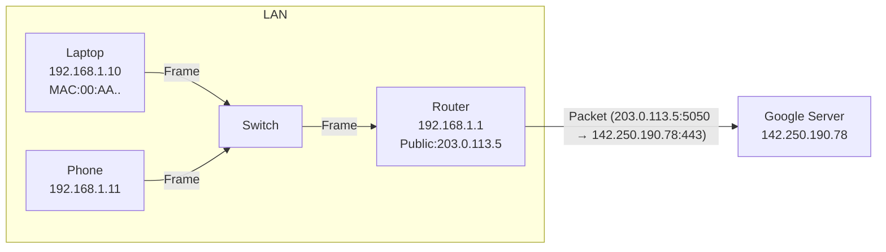

# How Networking Components Interact

## 1. IP Address ↔ Port ↔ Socket
- **IP address**: Identifies a device on a network.
- **Port**: Identifies a service/application on that device.
- **Socket**: Combination of (IP + Port).

### Relationships:
- One **IP address** can host **many ports** (up to 65,535).  
- One **socket** = unique `(source IP, source port, destination IP, destination port)`.  
- Example:
  - Client: `192.168.1.10:5050`
  - Server: `172.217.160.78:443`
  - Socket pair = `(192.168.1.10:5050, 172.217.160.78:443)`

---

## 2. MAC Address ↔ IP Address
- MAC = hardware address (Layer 2).
- IP = logical address (Layer 3).
- Mapping done using **ARP** (Address Resolution Protocol).
- Example:
  - IP `192.168.1.10` ↔ MAC `00:1A:2B:3C:4D:5E`

---

## 3. Switches vs Routers
- **Switch**:
  - Works with **MAC addresses** (Layer 2).
  - Forwards frames within a LAN.
- **Router**:
  - Works with **IP addresses** (Layer 3).
  - Forwards packets between different networks.

---

## 4. Node vs Host
- **Node** = any device on the network.
- **Host** = node that can send/receive data directly (e.g., laptop, phone).
- Routers/switches = nodes but not usually "hosts."

---

## 5. Flow Example (Home → Website)
1. Laptop app opens `https://google.com`.
2. **DNS** resolves domain → IP (e.g., `142.250.190.78`).
3. Laptop chooses a **random source port** (say `5050`).
4. A **TCP socket** is formed:
   - `(192.168.1.10:5050 → 142.250.190.78:443)`
5. Data travels:
   - Laptop NIC → **Switch** → **Router** (gateway).
   - Router replaces source IP with **public IP** using NAT.
   - Sent over Internet → Destination server.

---

## 6. Multiplicity
- **One IP → Many sockets**  
  - A single device can have multiple simultaneous connections using different ports.
- **One port → One service (per IP)**  
  - Port 80 on IP `192.168.1.10` usually = web server.
- **One socket → One connection**  
  - Defined by `(src IP, src port, dst IP, dst port)`.

---

## 7. Visual Diagram (Mermaid)

# Networking Glossary

## IP Address
- **What**: A unique logical address that identifies a device on a network.  
- **Types**:
  - IPv4: 32-bit (e.g., `192.168.1.1`).
  - IPv6: 128-bit (e.g., `2001:db8::1`).  
- **Purpose**: Tells "where" a device is.

---

## Port
- **What**: A number that identifies a specific application/service on a device.  
- **Examples**:
  - 80 → HTTP
  - 443 → HTTPS
  - 22 → SSH  
- **Purpose**: Tells "what service" you want on that IP.

---

## MAC Address
- **What**: A unique physical hardware address of a network card (e.g., `00:1A:2B:3C:4D:5E`).  
- **Purpose**: Used in LAN for device-to-device delivery.

---

## Node
- **What**: Any device connected to a network.  
- **Examples**: Computers, servers, routers, switches, IoT devices.

---

## Host
- **What**: A type of node that can send/receive data (end device).  
- **Examples**: Laptop, smartphone, server.

---

## Switch
- **What**: A Layer 2 device that connects multiple devices within a LAN.  
- **Function**: Uses MAC addresses to forward frames only to the correct device.  
- **Note**: Smarter than a hub (which just broadcasts).

---

## Router
- **What**: A Layer 3 device that connects different networks together.  
- **Function**: Uses IP addresses and routing tables to forward packets.  

---

## Gateway
- **What**: The exit/entry point of a network (often the router).  
- **Purpose**: Lets your LAN talk to the outside world (Internet).

---

## DNS (Domain Name System)
- **What**: Translates domain names into IP addresses.  
- **Example**: `www.google.com → 142.250.190.78`

---

## Protocol
- **What**: A set of rules for communication.  
- **Examples**:
  - HTTP/HTTPS (web)
  - FTP (file transfer)
  - SMTP (email)
  - TCP/UDP (transport)

---

## Packet
- **What**: A unit of data transmitted over a network.  
- **Structure**: Header (source/dest info) + Payload (data).  

---

## Frame
- **What**: A packet with extra link-layer information (used in Ethernet).  
- **Difference**: Packets are Layer 3 (IP), Frames are Layer 2 (MAC).

---

## Socket
- **What**: Combination of IP + Port = uniquely identifies a network connection.  
- **Example**: `192.168.1.5:443`

---

## Firewall
- **What**: A security device/software that filters network traffic.  
- **Function**: Allows/blocks traffic based on rules.

---
