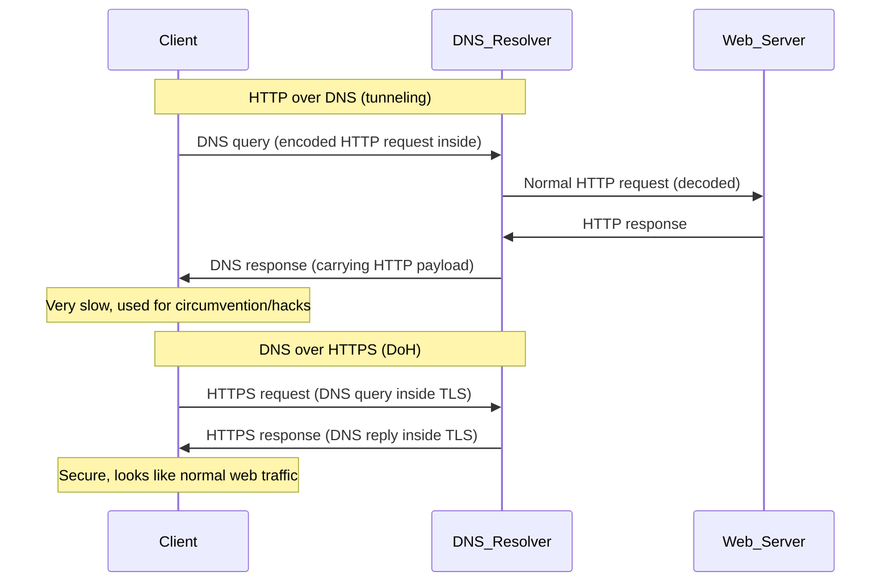

DoT, DoH, DoQ

Note that while encrypting DNS queries over HTTPS/TLS is encryption, do not conflate with privacy
DoH (encrypted 443, share with regular HTTPS traffic)
DoT (encrypted dedicated port 853, easy to block)
Pure DNS (unecrypted 53, easy to snoop)

The **centralised** queries to the DoH provider may not be good since your DNS operator, encrypted or not can see everything anyway

---

## 1. HTTP over DNS (DNS tunnelling attack)
- **What**: Encodes HTTP (or arbitrary traffic) inside DNS queries/responses.  
- **Why**: Circumvent firewalls (since DNS 53 is often allowed).  
- **How**:
  - Client encodes HTTP payloads into fake DNS requests.
  - Special DNS server decodes them and proxies to the web.  
- **Status**: Hacky, inefficient, used for penetration testing, malware C2, censorship bypass.  
- **Analogy**: Smuggling web browsing inside "DNS envelopes."

---

## 2. DNS over HTTP(S) (DoH)
- **What**: A real standard: DNS queries wrapped in HTTPS.  
- **Why**: Privacy — hides DNS lookups inside encrypted HTTPS traffic.  
- **Port**: 443 (same as normal web traffic).  
- **Benefit**: ISPs and middleboxes can’t see/modify DNS easily.  
- **Analogy**: Asking for directions (DNS) inside a secure webmail message (HTTPS).

---

## 3. DNS over TLS (DoT)
- **What**: DNS queries sent directly over TLS.  
- **Port**: 853.  
- **Benefit**: Encrypted, but port 853 is obvious → easy to block.  
- **Analogy**: A dedicated secure phone line just for DNS.

---

## 4. DNS over QUIC (DoQ)
- **What**: Newer approach: DNS queries over QUIC (UDP + TLS 1.3).  
- **Port**: 853 (same as DoT, but over UDP).  
- **Benefit**:
  - Encrypted like DoT.
  - Lower latency than TCP/TLS (no head-of-line blocking).
- **Analogy**: Faster, modern secure line for DNS.

---

## 5. Quick Comparison

| Protocol      | What it means                       | Port | Encrypted?            | Typical Use Case                |
| ------------- | ----------------------------------- | ---- | --------------------- | ------------------------------- |
| HTTP over DNS | Smuggling HTTP inside DNS           | 53   | No (DNS is cleartext) | Circumvention, hacking          |
| DoH           | DNS queries inside HTTPS            | 443  | Yes (TLS)             | Privacy, hard to block          |
| DoT           | DNS queries over TLS                | 853  | Yes                   | Secure DNS, easy to filter      |
| DoQ           | DNS queries over QUIC (UDP + TLS13) | 853  | Yes                   | Secure + fast DNS, experimental |

---

# Key Distinctions
- **HTTP over DNS** = obscure tunneling (rare, hacky).  
- **DNS over X (DoT/DoH/DoQ)** = mainstream privacy/security standards.  
  - DoT = DNS over TLS (853).  
  - DoH = DNS over HTTPS (443).  
  - DoQ = DNS over QUIC (853).

# HTTP over DNS vs DNS over HTTPS (DoH)

