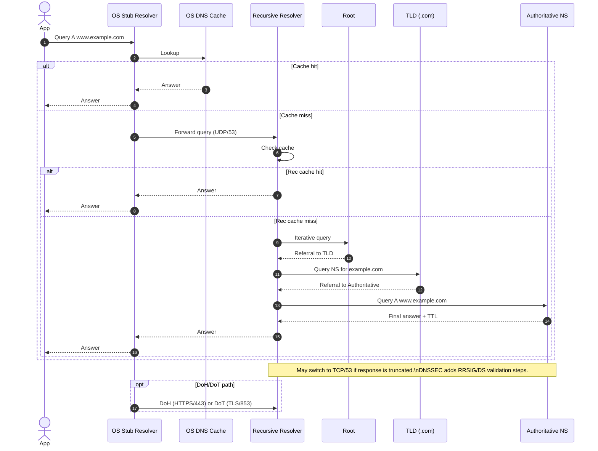

![[Pasted image 20250926025736.png]]
1. Application payload, wrapped by TCP segment by OS, wrapped by IP datagram in OS
2. Wrapped to Link frame by NIC
3. Link layer WIFI/Ethernet switches via MAC
4. Within the subnet to Network Layer router
5. Router unwraps Link frame to IP datagram
6. In-router switching fabric move packet from input port to output port
7. Router buffer if necessary, drop packets if necessary, use scheduling algos (RR, PQ, weighted RR)
8. Router finds next destination in routing table
9. Router wraps to Link Frame
10. Go through multiple subnet/router until dest
11. Reverse

