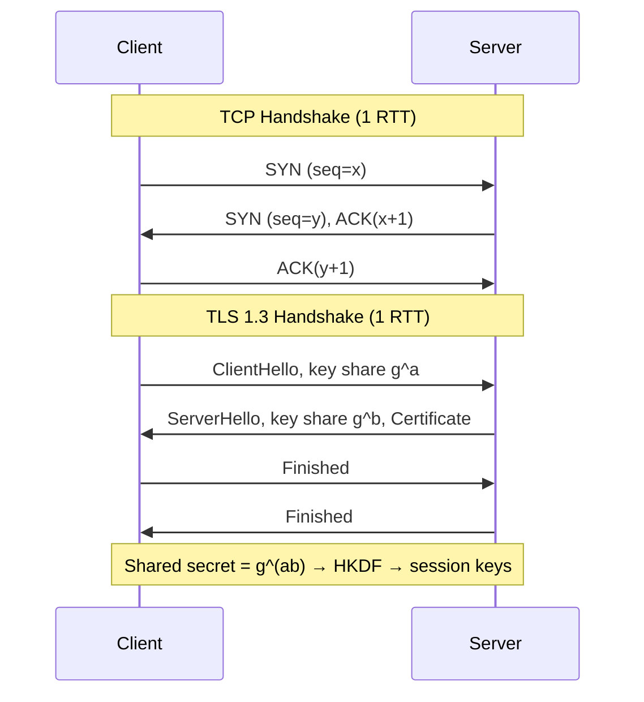
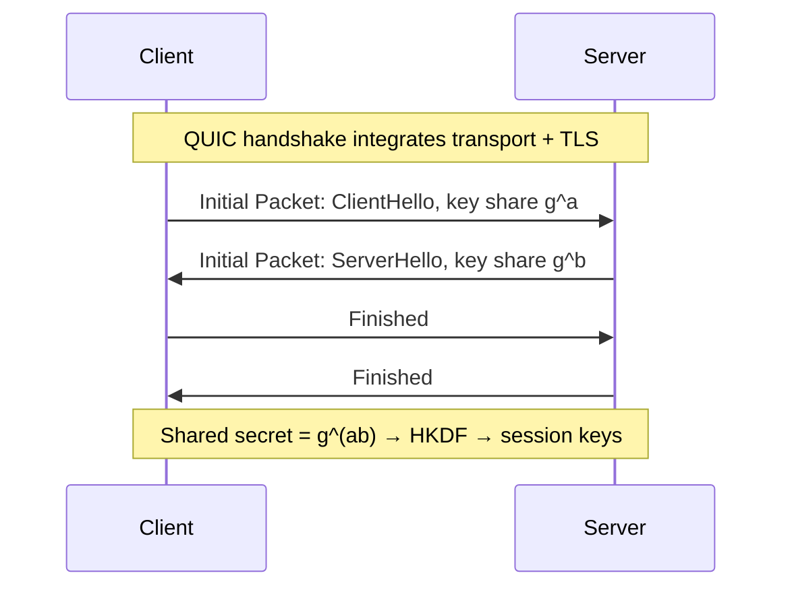
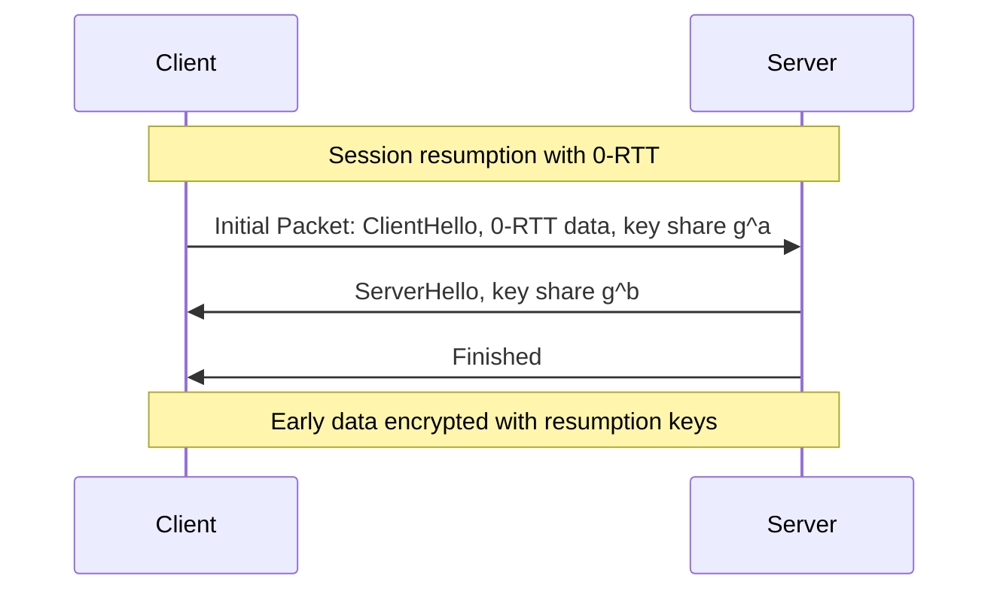

### What’s the difference between TCP and UDP?
| Feature     | **TCP (Transmission Control Protocol)**                                          | **UDP (User Datagram Protocol)**                                        |
| ----------- | -------------------------------------------------------------------------------- | ----------------------------------------------------------------------- |
| Connection  | Connection-oriented (requires setup)                                             | Connectionless (no setup)                                               |
| Reliability | Reliable: guarantees delivery, retransmits lost packets, ensures correct order   | Unreliable: no guarantee of delivery, ordering, or duplicate protection |
| Overhead    | Higher (due to acknowledgments, headers ~20 bytes)                               | Lower (smaller header ~8 bytes)                                         |
| Speed       | Slower, due to connection management and reliability mechanisms                  | Faster, due to minimal overhead                                         |
| Use cases   | Web browsing (HTTP/HTTPS), email (SMTP), file transfer (FTP), remote login (SSH) | Streaming (video/audio), DNS queries, VoIP, online gaming               |

---

### Explain the 3-way handshake in TCP
The **TCP 3-way handshake** is used to establish a reliable connection between client and server:
SYN + SYN-ACK comprise 1 RTT

1. **SYN** (synchronize):  
   - Client sends a TCP segment with the SYN flag set.  
   - Indicates a request to establish a connection and includes the client’s initial sequence number.

2. **SYN-ACK** (synchronize-acknowledge):  
   - Server responds with a segment that has both SYN and ACK flags set.  
   - Acknowledges client’s sequence number and sends its own initial sequence number.

3. **ACK** (acknowledge):  
   - Client sends back an ACK to confirm receipt of the server’s SYN.  
   - At this point, the connection is established, and data transfer can begin.

### QUIC + TLS1.3
- **QUIC (over UDP):**
    1. QUIC integrates TLS 1.3 inside its transport.
    2. First client packet contains both the transport connection request _and_ the TLS ClientHello.
    3. Server responds with transport state + TLS ServerHello in one packet.  
        ⇒ Secure channel and transport are ready after **1 RTT**.      
- **0-RTT in QUIC:** if client has previously connected, it can send app data in its very first packet (encrypted with resumption keys). Server can accept or reject it.

Why possible
- QUIC runs in user space over UDP, so it avoids kernel TCP stack constraints.
- TLS 1.3 reduced handshake messages vs TLS 1.2

![[Tcp-vs-quic-handshake.svg.png]]

| Aspect                 | **TCP + TLS 1.3 (HTTP/2)**                                        | **QUIC + TLS 1.3 (HTTP/3)**              |
| ---------------------- | ----------------------------------------------------------------- | ---------------------------------------- |
| Transport handshake    | TCP 3-way (SYN, SYN-ACK, ACK)                                     | None (QUIC integrates transport)         |
| Crypto handshake       | TLS 1.3 on top of TCP                                             | TLS 1.3 built into QUIC                  |
| Key exchange math      | ECDHE: client g^a, server g^b → shared g^(ab), then HKDF for keys | Same: ECDHE g^a, g^b → g^(ab), then HKDF |
| Fresh connection RTT   | **2 RTT** (1 TCP + 1 TLS)                                         | **1 RTT** (QUIC+TLS together)            |
| Resumed connection RTT | **1 RTT** (TCP + 0-RTT TLS)                                       | **0 RTT** (0-RTT QUIC+TLS)               |
| Head-of-line blocking  | Yes (TCP level)                                                   | No (independent QUIC streams)            |

### TCP 3-way (1 RTT) + TLS1.3 (1 RTT) = 2RTT

### QUIC + TLS 1.3 (1 RTT)

### QUIC + TLS1.3 (0 RTT)

