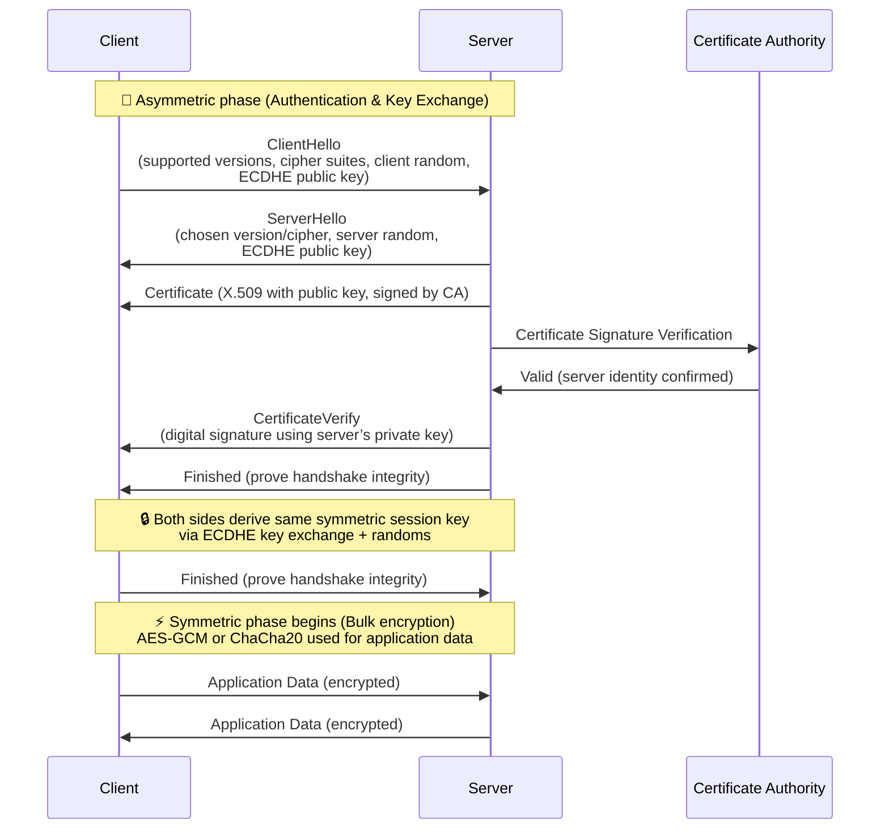

# TLS (Transport Layer Security)

## 1. Purpose
TLS provides:
- **Confidentiality** → Encrypts traffic.  
- **Integrity** → Detects tampering.  
- **Authentication** → Verifies server identity (and sometimes client).  

---

## 2. TLS Handshake (Simplified)

1. **ClientHello**
   - Client sends supported TLS versions, cipher suites, random value.

2. **ServerHello**
   - Server picks protocol version, cipher suite, sends its random value.

3. **Certificate**
   - Server sends its X.509 certificate (contains public key, domain name, CA signature).

4. **Key Exchange**
   - Client & server agree on a shared secret:
     - RSA (older): Client encrypts session key with server’s public key.
     - ECDHE (modern): Diffie-Hellman key exchange with server’s public key.

5. **Symmetric Session Key Established**
   - Both sides derive the same session key (from randoms + key exchange).

6. **Finished**
   - Both sides confirm and switch to symmetric encryption.

---

## 3. What’s in a TLS Certificate?

TLS certificates are **X.509** structures. Common fields:
- **Subject**: Domain name (e.g., `www.example.com`).
- **Issuer**: Certificate Authority (CA) that signed it.
- **Public Key**: Server’s asymmetric key (RSA/ECDSA).
- **Validity Period**: Start/end date.
- **Extensions**:
  - Subject Alternative Names (SANs): multiple domains.
  - Key Usage (signing, encryption).
- **Signature**: CA’s digital signature over the certificate contents.

---

## 4. Symmetric vs Asymmetric in TLS

- **Asymmetric (Public/Private key crypto)**
  - Used in handshake (authentication, key exchange).
  - Example: RSA, ECDSA, ECDHE.
  - Slow, so used only at the start.

- **Symmetric (Shared secret crypto)**
  - Used for bulk data encryption after handshake.
  - Example: AES-GCM, ChaCha20-Poly1305.
  - Fast, efficient for large traffic.

---

## 5. TLS in Practice
- **Asymmetric phase**: Establish trust + derive session key.
- **Symmetric phase**: Encrypt/decrypt application data.
- **MAC/AEAD**: Provide integrity (HMAC, or built into AES-GCM/ChaCha20).

---

## 6. Example Flow (TLS 1.2 with RSA)
1. Client → Server: Hello.
2. Server → Client: Hello + Certificate (RSA public key).
3. Client → Server: Generate random session key, encrypt with RSA pubkey, send.
4. Server → Client: Decrypt with RSA private key, recover session key.
5. Both sides: Switch to symmetric AES session key.

---

## 7. Example Flow (TLS 1.3 with ECDHE)
1. Client & Server exchange **ephemeral Diffie-Hellman keys**.
2. Both compute same session key.
3. Server proves identity with certificate + digital signature.
4. Both switch to AES-GCM or ChaCha20.

---

## 8. Key Points
- Certificate = proves server identity, contains public key.  
- Asymmetric crypto = handshake (authentication + key exchange).  
- Symmetric crypto = actual data encryption (fast, efficient).  
- TLS 1.3 simplified handshake, dropped RSA key transport in favor of ECDHE.  

