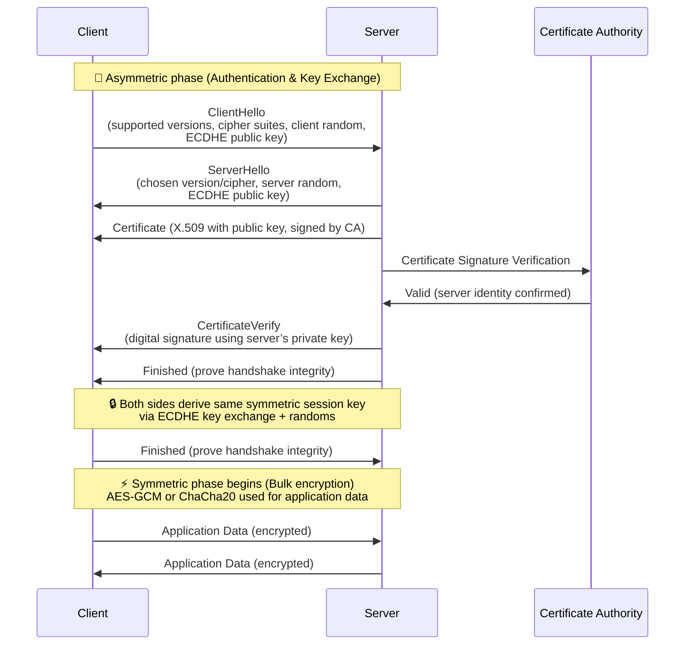

# TLS (Transport Layer Security)

## 1. Purpose
TLS provides:
- **Confidentiality** → Encrypts traffic.  
- **Integrity** → Detects tampering.  
- **Authentication** → Verifies server identity (and sometimes client).  

---

## 2. TLS Handshake (Simplified)

1. Server sends its **certificate** (contains its public key + CA signature).
2. Browser checks the certificate chain back to a trusted CA.
3. Browser uses the server’s **public key** to verify the TLS handshake (RSA/ECDHE).
4. If valid, they agree on a **symmetric session key (AES)** for fast encrypted communication.

---

## 3. What’s in a TLS Certificate?

TLS certificates are **X.509** structures. Common fields:
- **Subject**: Domain name (e.g., `www.example.com`).
- **Issuer**: Certificate Authority (CA) that signed it.
- **Public Key**: Server’s asymmetric key (RSA/ECDSA).
- **Validity Period**: Start/end date.
- **Extensions**:
  - Subject Alternative Names (SANs): multiple domains.
  - Key Usage (signing, encryption).
- **Signature**: CA’s digital signature over the certificate contents.

A public key in a website needs to be certified so
- **so we know this server is really example.com**
- A certificate is validated by a trusted CA or a chain of trusted CA
- Trusted CAs are cached in the browser/OS, 
- The first CA is manually configured 

## 4. RSA, SHA, AES
| Algorithm                  | Type                                | Purpose                                 | Where Used                                       | Notes                                                                                                 |
| -------------------------- | ----------------------------------- | --------------------------------------- | ------------------------------------------------ | ----------------------------------------------------------------------------------------------------- |
| **RSA**                    | Asymmetric (public/private)         | Encryption, **Digital Signatures**      | JWT (RS256),  digital certs                | Strong but slower at large key sizes; 2048-bit common baseline                                        |
| **ECDHE**                  | Asymmetric (elliptic curve)         | **Key Exchange** (derive shared secret) | TLS handshakes                                   | Ephemeral = PFS (Perfect Forward Secrecy); not for signatures                                         |
| **ECDSA**                  | Asymmetric (elliptic curve)         | **Digital Signatures**                  | JWT (ES256, ES384, ES512),   Digital certs | Smaller key sizes for same security as RSA, but signature/verify asymmetry (sign fast, verify slower) |
| **EdDSA (Ed25519, Ed448)** | Asymmetric (elliptic curve, modern) | **Digital Signatures**                  | JWT (EdDSA),   SSH keys,   TLS       | Faster, simpler, constant-time (resists side-channel attacks)                                         |

# Hash vs Digest vs Signature vs Salt

|Term|What it is|Purpose|Example|
|---|---|---|---|
|**Hash**|One-way function: input → fixed-size output|Integrity check, data fingerprint|`SHA-256("hello") = 2cf24d...`|
|**Digest**|The **output** of a hash function|The actual hash value|`2cf24dba5...` is the digest of `"hello"`|
|**Signature**|Cryptographic proof created with a **private key** over a message (usually its hash)|Authenticity + integrity + non-repudiation|`RSA_sign( SHA256(payload), private_key )`|
|**Salt**|Random value added before hashing|Prevents pre-computed attacks (rainbow tables)|`hash(password + salt)` for password storage|

#### **ECDHE** = **Elliptic Curve Diffie–Hellman Ephemeral**. 

For **sharing** a secret  without sharing the secret

1. Client and server agree on DH parameters (prime `p`, generator `g` or curve).
2. Client picks random secret `a`, sends `A = g^a mod p`.
3. Server picks random secret `b`, sends `B = g^b mod p`.
4. Both compute shared
	- Client: `K = B^a mod p`.
	- Server: `K = A^b mod p`.
	- Both get the same `K`.

### Bcrypt

Generate random salt per password

`hash(password + salt)`

The salt is stored in cleartext

$2b \$12\$ N9qo8uLOickgx2ZMRZoMye IjZAg9x36PgojO6aG9a8pB9p46iXWZS
- `$2b$` → bcrypt version
- `12$` → cost factor (2^12 iterations)
- `N9qo8uLOickgx2ZMRZoMye` → salt in cleartext (22 chars base64)
- `IjZAg9x36PgojO6aG9a8pB9p46iXWZS` → hash(password + salt)