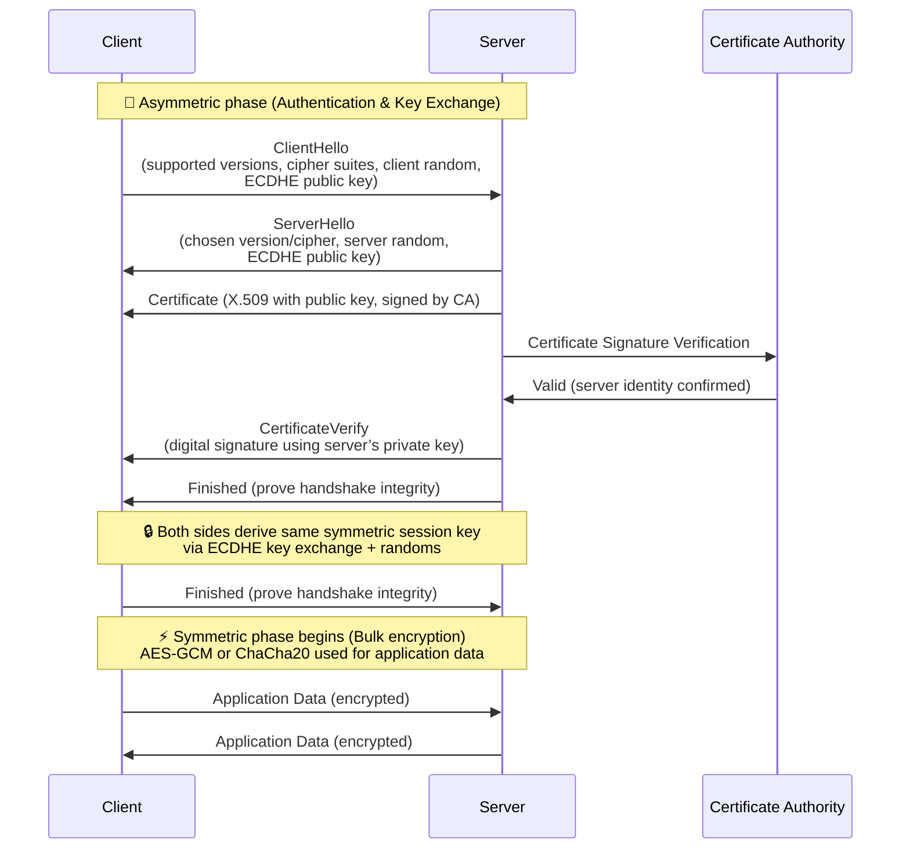

# TLS (Transport Layer Security)

## 1. Purpose
TLS provides:
- **Confidentiality** → Encrypts traffic.  
- **Integrity** → Detects tampering.  
- **Authentication** → Verifies server identity (and sometimes client).  

---

## 2. TLS Handshake (Simplified)

1. Server sends its **certificate** (contains its public key + CA signature).
2. Browser checks the certificate chain back to a trusted CA.
3. Browser uses the server’s **public key** to verify the TLS handshake (RSA/ECDHE).
4. If valid, they agree on a **symmetric session key (AES)** for fast encrypted communication.

---

## 3. What’s in a TLS Certificate?

TLS certificates are **X.509** structures. Common fields:
- **Subject**: Domain name (e.g., `www.example.com`).
- **Issuer**: Certificate Authority (CA) that signed it.
- **Public Key**: Server’s asymmetric key (RSA/ECDSA).
- **Validity Period**: Start/end date.
- **Extensions**:
  - Subject Alternative Names (SANs): multiple domains.
  - Key Usage (signing, encryption).
- **Signature**: CA’s digital signature over the certificate contents.

A public key in a website needs to be certified so
- **so we know this server is really example.com**
- A certificate is validated by a trusted CA or a chain of trusted CA
- Trusted CAs are cached in the browser/OS, 
- The first CA is manually configured 

