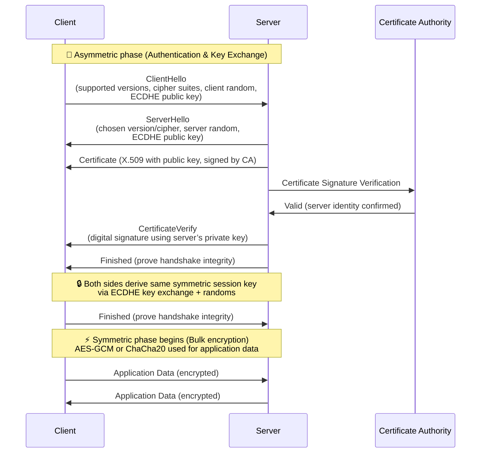

# TLS (Transport Layer Security)

## 1. Purpose
TLS provides:
- **Confidentiality** → Encrypts traffic.  
- **Integrity** → Detects tampering.  
- **Authentication** → Verifies server identity (and sometimes client).  

---

## 2. TLS Handshake (Simplified)

1. Server sends its **certificate** (contains its public key + CA signature).
2. Browser checks the certificate chain back to a trusted CA.
3. Browser uses the server’s **public key** to verify the TLS handshake (RSA/ECDHE).
4. If valid, they agree on a **symmetric session key (AES)** for fast encrypted communication.

---

## 3. What’s in a TLS Certificate?

TLS certificates are **X.509** structures. Common fields:
1. **Subject**: Domain name (e.g., `www.example.com`).
2. **Issuer**: Certificate Authority (CA) that signed it.
3. **Public Key**: Server’s asymmetric key (RSA/ECDSA).
4. **Validity Period**: Start/end date.
5. **Extensions**:
	- Subject Alternative Names (SANs): multiple domains.
	- Key Usage (signing, encryption).
6. **Signature**: CA’s digital signature over the certificate contents.

A public key in a website needs to be certified so
- **so we know this server is really example.com**
- A certificate is validated by a trusted CA or a chain of trusted CA
- Trusted CAs are cached in the browser/OS, 
- The first CA is manually configured 

When browser connects:
1. server sends certificate
2. browser checks 
	1. CA signature chain
	2. domain matches URL
	3. certificate still valid

ClientHello (cipher suites, SNI)
Serverhello (+ certificate, key share)

PKI: CA‑signed certificates; hostname verification (SAN); OCSP/CRL for revocation.
HTTP: HTTPS = HTTP over TLS; HSTS and ALPN (HTTP/2, HTTP/3).

- ECDHE · certificate validation · forward secrecy · ALPN · HSTS

```mermaid
sequenceDiagram
    participant C as Client
    participant S as Server
    participant CA as Certificate Authority

    Note over C,S: 🔑 Asymmetric phase (Authentication & Key Exchange)

    C->>S: ClientHello<br/>(supported versions, cipher suites, client random,<br/>ECDHE public key)
    S->>C: ServerHello<br/>(chosen version/cipher, server random,<br/>ECDHE public key)
    S->>C: Certificate (X.509 with public key, signed by CA)
    S->>CA: Certificate Signature Verification
    CA->>S: Valid (server identity confirmed)
    S->>C: CertificateVerify<br/>(digital signature using server’s private key)
    S->>C: Finished (prove handshake integrity)

    Note over C,S: 🔒 Both sides derive same symmetric session key<br/>via ECDHE key exchange + randoms

    C->>S: Finished (prove handshake integrity)

    Note over C,S: ⚡ Symmetric phase begins (Bulk encryption)<br/>AES-GCM or ChaCha20 used for application data
    C->>S: Application Data (encrypted)
    S->>C: Application Data (encrypted)
```

